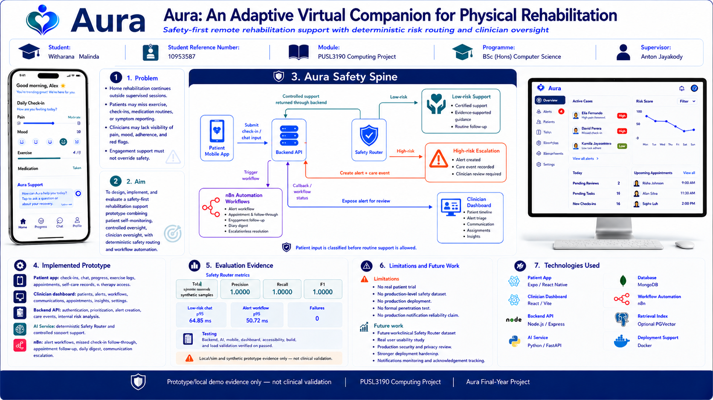

# Aura: An Adaptive Virtual Companion for Physical Rehabilitation



Aura is a final-year computing project developed for **PUSL3190 Computing Project**. It is a local/demo rehabilitation support prototype that combines patient self-monitoring, deterministic safety routing, clinician oversight, and workflow automation.

> **Prototype/local demo evidence only — not clinical validation.**

## Project Overview

Aura addresses the problem that much physical rehabilitation continues outside supervised clinical sessions. Patients may miss check-ins, exercises, medication routines, or symptom reporting, while clinicians may lack day-to-day visibility of pain, mood, adherence, and red flags.

The project implements a safety-first architecture where patient input is routed through a deterministic Safety Router before routine support continues. Low-risk inputs receive controlled support, while high-risk inputs create clinician-visible alerts and care-event records for review.

## Main Components

The main implementation is located inside the `aura/` directory.

```text
aura/
├── server/        Node.js / Express backend API
├── ai/            Python / FastAPI AI service
├── dashboard/     React / Vite clinician dashboard
├── mobile/        Expo / React Native patient app
├── n8n/           n8n workflow exports and automation documentation
├── docs/          Documentation, evidence files, screenshots, and benchmark notes
└── docker-compose.yml
```

## Technology Stack

| Area | Technology |
|---|---|
| Patient app | Expo / React Native |
| Clinician dashboard | React / Vite |
| Backend API | Node.js / Express |
| AI service | Python / FastAPI |
| Database | MongoDB |
| Workflow automation | n8n |
| Optional retrieval infrastructure | PostgreSQL / PGVector |
| Local infrastructure | Docker Compose |

## Core Features

- Patient daily check-ins for recovery information.
- Safety-routed patient chat.
- Deterministic Safety Router for high-risk input detection.
- Clinician dashboard for patient review, alerts, worklists, communication, appointments, insights, and settings.
- Alert and care-event creation for high-risk disclosures.
- n8n local/demo workflows for alert notification, missed check-in follow-through, task reminders, appointment follow-up, daily digest, and communication escalation.
- Synthetic presentation/demo seed data for evaluation and demonstration.

## Safety-First Flow

```text
Patient Mobile App
→ Backend API
→ Safety Router
→ Low-risk support or High-risk escalation
→ Clinician Dashboard
→ n8n workflow automation where configured
```

High-risk patient input is not treated as normal chatbot interaction. It is routed into clinician-visible review artefacts such as alerts, care events, and workflow status records.

## Repository Structure

```text
.
├── assets/              README images and poster assets
├── aura/                Main Aura monorepo implementation
└── .gitignore           Git ignore rules
```

Inside the main `aura/` project folder:

```text
aura/
├── server/              Backend API
├── ai/                  AI service and Safety Router
├── dashboard/           Clinician dashboard
├── mobile/              Patient mobile app
├── n8n/                 Workflow exports and automation notes
├── docs/                Evidence files, report support, and documentation
└── docker-compose.yml   Local infrastructure configuration
```

## Local Development Overview

Aura is designed to run as a multi-service local/demo system. Typical services include:

- MongoDB
- Node.js / Express backend API
- Python / FastAPI AI service
- React / Vite clinician dashboard
- Expo / React Native patient app
- n8n automation workflows

A typical local startup order is:

```text
1. Start Docker-supported services.
2. Start the backend API.
3. Start the AI service.
4. Start the clinician dashboard.
5. Start the patient mobile app.
6. Open n8n where workflow demonstration is required.
```

Detailed setup, environment configuration, startup commands, demo access details, and troubleshooting guidance are provided in the final report appendix.

## Important Safety and Privacy Notes

- Aura is an academic prototype, not a deployed clinical system.
- Demo data is synthetic and should not be treated as real patient data.
- The system does not provide emergency medical response.
- The system does not replace clinician judgement.
- Safety Router results are prototype evidence, not clinical validation.
- n8n notification behaviour is local/demo evidence, not production notification assurance.
- Secret keys, private environment files, API keys, webhook keys, and sensitive credentials should not be committed to the repository.

## Environment Configuration

Aura uses local environment variables for service URLs, database connection strings, internal workflow keys, and demo configuration.

Real `.env` files should not be committed. Sanitised examples are provided in the project documentation and final report appendix.

Example environment values may include:

```env
MONGO_URL=mongodb://127.0.0.1:27017/aura
AI_SERVICE_URL=http://127.0.0.1:8001
AURA_WEBHOOK_KEY=<local-demo-webhook-key>
AURA_N8N_WEBHOOK_KEY=<local-demo-webhook-key>
AURA_N8N_API_KEY=<local-demo-api-key>
AURA_PRESENTATION_SEED_ENABLED=true
```

## Evidence and Evaluation

The project includes supporting evidence for local/demo evaluation, including:

- Safety Router synthetic evaluation evidence.
- Local latency benchmark notes.
- Dashboard UI/UX verification evidence.
- Mobile accessibility and QA evidence.
- n8n workflow verification and runtime evidence.
- Screenshots and documentation for final report support.

All evaluation evidence should be interpreted as local/demo prototype evidence, not clinical validation.

## Author

**Witharana Malinda**  
Student Reference Number: **10953587**  
Module: **PUSL3190 Computing Project**  
Programme: **BSc (Hons) Computer Science**  
Supervisor: **Anton Jayakody**

## Project Status

Final-year academic project prototype for submission and demonstration.
